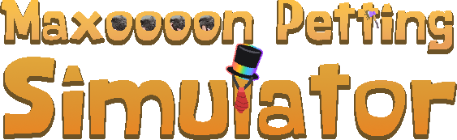

    

    
    
    

# Maxon Petting Simulator (Open-Source)
Maxon Petting Simulator source code release. The game is built in Java and uses LibGDX as the main game framework. It is built using Gradle.

> If you have any questions or issues, submit them on [Issues](https://github.com/notdankenough/maxonpettingsim/issues)!

## Building
To compile this project you will need [JDK 11](https://adoptium.net/). Copy the repository and open it via the terminal and do what you need:
### Game (For desktop):
*Running*: `./gradlew desktop:run` 
*Building*: `./gradlew desktop:dist`

## License
This project is under the Mozilla Public License 2.0! [Read on LICENSE](https://github.com/NotDankEnough/MaxonPettingSim/blob/master/LICENSE). 
Project Assets under the [Creative Commons Attribution v4.0 International](https://creativecommons.org/licenses/by/4.0/)!