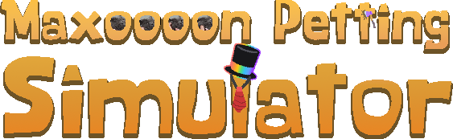

    <h1></h1>

Maxon Petting Simulator source code release. The game is built on Rust and uses [the Bevy game engine](https://bevyengine.org). [Previously it used Java/LibGDX.](https://github.com/ilotterytea/maxon/tree/2c54c6e7590d86159e2e44368caa760945d041cd)

## Building
To compile this project you will need [Rust](https://www.rust-lang.org) and at least 10 GB of free space . Copy the repository, open it via terminal (or Command Prompt, PowerShell) and do what you need to do:

### Game (For desktop):
*Running with release optimizations*: `cargo run --release` 
*Running with debug features*: `cargo run -F debug` 
*Building*: `cargo build` (the final file will be available at `/target/debug/maxon`) 

## License
This project is under the Mozilla Public License 2.0! [Read on LICENSE](https://github.com/NotDankEnough/MaxonPettingSim/blob/master/LICENSE). 
Project Assets under the [Creative Commons Attribution v4.0 International](https://creativecommons.org/licenses/by/4.0/)!